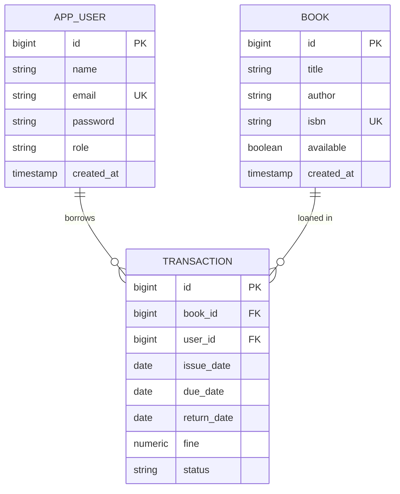

# Library Management System

A full-stack library management web app with a Spring Boot REST API and a React + Tailwind UI. Members can browse and borrow books; admins manage the catalog, users, and issue/return transactions with automatic late-fee calculation.

> Built as a Java portfolio project to demonstrate layered architecture, SOLID principles, JWT authentication, and a polished React UI.

---

## Features

- JWT-secured REST API with role-based access (`ADMIN`, `MEMBER`)
- Full CRUD on books and users
- Issue / return book flow with a 14-day loan period
- Automatic fine calculation: ₹5 per day past the due date
- Search books by title or author (case-insensitive, paginated)
- Pagination + sorting on every list endpoint
- Global exception handling with consistent error JSON
- Polished React UI with Tailwind: dashboard, search, modal forms, toasts, role-aware sidebar
- Cloud Postgres via Neon (SSL, serverless-friendly Hikari pool)

---

## Tech stack

| Layer | Technology |
|---|---|
| Backend | Spring Boot 4.0.5, Java 17, Spring Security, Spring Data JPA, Hibernate |
| Auth | JWT (jjwt 0.12), BCrypt |
| Database | PostgreSQL (Neon) |
| Build | Maven |
| Lib | Lombok, Bean Validation |
| Frontend | React 18, TypeScript, Vite, Tailwind CSS |
| HTTP | Axios with token interceptor |
| Routing | React Router 6 |

---

## Architecture

```
┌─────────────────┐       ┌────────────────────────────┐       ┌──────────────┐
│  React (Vite)   │  HTTP │  Spring Boot REST API      │  JDBC │  Neon        │
│  Tailwind UI    │──────▶│  Controller → Service →    │──────▶│  PostgreSQL  │
│  JWT in storage │       │  Repository → JPA Entity   │       │  (SSL)       │
└─────────────────┘       └────────────────────────────┘       └──────────────┘
                                       │
                                       ▼
                          ┌──────────────────────────┐
                          │ Spring Security Filter   │
                          │ Chain + JwtAuthFilter    │
                          └──────────────────────────┘
```

Backend layout:

```
com.sahilkumar.Library.Management.System
├── controller/      REST endpoints (thin, ResponseEntity-only)
├── service/         interfaces
│   └── impl/        business logic, transactional
├── repository/      Spring Data JPA
├── entity/          @Entity classes (Book, AppUser, Transaction)
├── dto/
│   ├── request/     @Valid request bodies
│   └── response/    response shapes (no entities leak)
├── mapper/          entity ↔ DTO converters
├── exception/       custom exceptions + GlobalExceptionHandler
└── config/          SecurityConfig, JwtAuthenticationFilter, UserSecurity
```

---

## Database schema



---

## Setup

### Prerequisites

- Java 17+
- Maven (or use the bundled `./mvnw`)
- Node.js 18+
- A free [Neon](https://neon.tech) account for Postgres

### 1. Database (Neon)

1. Sign in to Neon → **Create project** → choose region.
2. Open **Connection Details** and copy the connection string. It looks like:
   ```
   postgresql://<user>:<pass>@<host>/<db>?sslmode=require
   ```
3. **Important:** Spring Boot needs the `jdbc:` prefix, so the value you put in `DB_URL` must be:
   ```
   jdbc:postgresql://<host>/<db>?sslmode=require
   ```
4. Tables are created automatically on first run (`spring.jpa.hibernate.ddl-auto=update`).

### 2. Backend

The cleanest local setup uses a gitignored override file. Copy the template and fill in your Neon details:

```bash
cp src/main/resources/application-local.properties.example src/main/resources/application-local.properties
```

Edit `application-local.properties`:

```properties
spring.datasource.url=jdbc:postgresql://<your-neon-host>/<your-db>?sslmode=require
spring.datasource.username=<your-neon-role>
spring.datasource.password=<your-neon-password>
app.jwt.secret=<at-least-32-chars>     # openssl rand -base64 48
```

Then run:

```bash
./mvnw spring-boot:run
```

The API listens on `http://localhost:8080`.

> Spring loads `application-local.properties` automatically (via `spring.config.import=optional:classpath:...`), but the file is gitignored so secrets never reach the repo. **Alternative:** set `DB_URL`, `DB_USER`, `DB_PASSWORD`, `JWT_SECRET` env vars instead — the main `application.properties` reads them via `${VAR:default}`.

### 3. Frontend

```bash
cd frontend
npm install
npm run dev
```

Open `http://localhost:5173`. The dev server proxies API calls to `http://localhost:8080/api` (configurable in `frontend/.env`).

### 4. Promote a user to admin

The first registered user is a `MEMBER` by default. To create an admin, register a normal account, then in the Neon SQL editor run:

```sql
UPDATE app_user SET role = 'ADMIN' WHERE email = 'you@example.com';
```

Log out and back in to refresh your role.

---

## Screenshots

> Replace the placeholders below with screenshots after running the app.

| | |
|---|---|
|  |  |
|  |  |

---

## API reference

All authenticated endpoints expect `Authorization: Bearer <token>`.

### Auth

| Method | Path | Auth | Body |
|---|---|---|---|
| `POST` | `/api/auth/register` | public | `{ name, email, password }` |
| `POST` | `/api/auth/login` | public | `{ email, password }` |

### Books

| Method | Path | Auth | Notes |
|---|---|---|---|
| `GET` | `/api/books?page=0&size=10&sort=id,asc` | any user | paginated |
| `GET` | `/api/books/{id}` | any user | |
| `GET` | `/api/books/search?q=clean&by=title` | any user | `by` = `title` or `author` |
| `POST` | `/api/books` | ADMIN | create |
| `PUT` | `/api/books/{id}` | ADMIN | update |
| `DELETE` | `/api/books/{id}` | ADMIN | |

### Users

| Method | Path | Auth |
|---|---|---|
| `GET` | `/api/users` | ADMIN |
| `GET` | `/api/users/{id}` | ADMIN or self |
| `PUT` | `/api/users/{id}` | ADMIN or self |
| `DELETE` | `/api/users/{id}` | ADMIN |

### Transactions

| Method | Path | Auth | Notes |
|---|---|---|---|
| `POST` | `/api/transactions/issue` | ADMIN | `{ bookId, userId }` |
| `POST` | `/api/transactions/{id}/return` | ADMIN | computes fine |
| `GET` | `/api/transactions` | ADMIN | paginated |
| `GET` | `/api/transactions/me` | any user | own history |

### Sample requests / responses

```jsonc
// POST /api/auth/register
{ "name": "Sukrit", "email": "sukrit@example.com", "password": "Passw0rd!" }

// 201 Created
{
  "token": "eyJhbGciOi...",
  "userId": 1,
  "email": "sukrit@example.com",
  "name": "Sukrit",
  "role": "MEMBER"
}
```

```jsonc
// POST /api/books   (ADMIN, Authorization: Bearer ...)
{ "title": "Clean Code", "author": "Robert C. Martin", "isbn": "9780132350884" }

// 201 Created
{
  "id": 1,
  "title": "Clean Code",
  "author": "Robert C. Martin",
  "isbn": "9780132350884",
  "available": true,
  "createdAt": "2026-04-16T10:00:00Z"
}
```

```jsonc
// POST /api/transactions/issue
{ "bookId": 1, "userId": 2 }

// 201 Created
{
  "id": 10,
  "bookId": 1, "bookTitle": "Clean Code",
  "userId": 2, "userName": "Sukrit",
  "issueDate": "2026-04-16",
  "dueDate":   "2026-04-30",
  "returnDate": null,
  "fine": 0,
  "status": "ISSUED"
}
```

```jsonc
// POST /api/transactions/10/return     (5 days late)
// 200 OK
{
  "id": 10,
  "returnDate": "2026-05-05",
  "fine": 25,
  "status": "RETURNED"
}
```

Error responses use a consistent shape:

```jsonc
// 409 Conflict
{
  "timestamp": "2026-04-16T10:30:00Z",
  "status": 409,
  "error": "Conflict",
  "message": "Book is not available: Clean Code",
  "path": "/api/transactions/issue"
}
```

A ready-to-import Postman collection is at `postman/Library-Management-System.postman_collection.json`. The login request includes a test script that captures the JWT into a collection variable, so subsequent requests authenticate automatically.

---

## Design decisions: SOLID & patterns

| Principle / Pattern | Where it shows up |
|---|---|
| **Single Responsibility** | Controllers only handle HTTP; services own business logic; mappers do entity↔DTO; repositories do persistence. |
| **Open/Closed** | New transaction rules can be added in `TransactionServiceImpl` without touching controllers. New search axes (e.g. ISBN) extend `BookRepository` without changing existing methods. |
| **Liskov Substitution** | `UserService extends UserDetailsService` — the impl is a drop-in for Spring Security. |
| **Interface Segregation** | Each service has a focused interface (`BookService`, `JwtService`, `AuthService`, …) so consumers depend only on what they use. |
| **Dependency Inversion** | Controllers and services depend on interfaces, not impls. Spring wires them via constructor injection (`@RequiredArgsConstructor`). |
| **Layered architecture** | Controller → Service → Repository → Entity, strictly one-way. |
| **DTO pattern** | No `@Entity` ever crosses the HTTP boundary. |
| **Repository pattern** | Spring Data JPA's `JpaRepository`. |
| **Strategy / polymorphism** | `BookService.search(q, by, …)` swaps between title and author repository methods based on `by`. |
| **Chain of Responsibility** | Spring Security filter chain plus the custom `JwtAuthenticationFilter`. |
| **Builder** | Lombok `@Builder` on entities, DTOs, and the `ApiError` envelope. |
| **Singleton** | All Spring beans are singletons by default. |

---

## Project structure

```
Library-Management-System/
├── src/main/java/com/sahilkumar/Library/Management/System/
│   ├── LibraryManagementSystemApplication.java
│   ├── config/        SecurityConfig, JwtAuthenticationFilter, UserSecurity
│   ├── controller/    AuthController, BookController, UserController, TransactionController
│   ├── dto/
│   │   ├── request/   *Request.java
│   │   └── response/  *Response.java, ApiError, PageResponse
│   ├── entity/        Book, AppUser, Transaction, Role, TransactionStatus
│   ├── exception/     custom exceptions + GlobalExceptionHandler
│   ├── mapper/        BookMapper, UserMapper, TransactionMapper
│   ├── repository/    BookRepository, UserRepository, TransactionRepository
│   └── service/
│       ├── *Service.java       (interfaces)
│       └── impl/*ServiceImpl.java
├── src/main/resources/application.properties
├── frontend/                          ← React app (Vite)
│   ├── src/
│   │   ├── auth/      AuthContext, ProtectedRoute
│   │   ├── components/{layout,ui}/
│   │   ├── lib/       api.ts, cn.ts
│   │   ├── pages/     Login/Register/Dashboard/Books/Users/Transactions/MyBooks
│   │   └── types/
│   └── package.json
├── postman/Library-Management-System.postman_collection.json
├── .env.example
├── pom.xml
└── README.md
```

---

## Verification checklist

- `./mvnw clean compile` — compiles cleanly.
- App starts and Hibernate creates tables `app_user`, `book`, `transaction` on Neon.
- `POST /api/auth/register` returns `201` with a JWT.
- `POST /api/books` without an admin token returns `403`; with one, `201`.
- Issue → return flow updates `book.available` and computes the right fine.
- React UI: login → dashboard renders stats; search filters books live; admin can issue and return.

---

## Future work

- Email reminders for upcoming due dates
- Reservation queue when a book is unavailable
- Refresh tokens + rotation
- Docker Compose for one-shot local setup
- Swagger/OpenAPI UI

---

## Author

**Sahil Kumar** — Java backend, Spring Boot, React.
